# 🚀 WinUp — Windows App Updater

Interfaccia grafica moderna e intuitiva per la **gestione centralizzata degli aggiornamenti Windows** tramite winget.
Visualizza, seleziona e aggiorna le tue applicazioni con un solo click, senza bisogno di terminale o comandi complessi.

**🆕 Versione 2.1.0** — Tema scuro, aggiornamenti asincroni, supporto config.json!

[](https://learn.microsoft.com/en-us/powershell/)
[](https://www.microsoft.com/it-it/windows)
[](../LICENSE)
[](https://github.com/Fagghino/BOT-AGGIORNA-APP/stargazers)
[](https://github.com/Fagghino/BOT-AGGIORNA-APP/commits/main)

> 🇬🇧 English documentation available in [`README.md`](../README.md)

---

## 🌟 Funzionalità Principali

### 📊 Interfaccia Tabellare Moderna
- **Visualizzazione a colonne:** Nome, ID, Versione Attuale, Versione Disponibile
- **Colonne auto-adattanti:** Larghezza ottimizzata automaticamente al contenuto
- **Selezione multipla:** Checkbox per ogni applicazione aggiornabile
- **Layout intelligente:** Pannelli ridimensionabili con splitter interattivo

### 🎯 Sistema di Aggiornamento Intelligente
- **Focus sugli aggiornamenti:** Mostra automaticamente solo le app aggiornabili all'avvio
- **Confronto versioni:** Visualizzazione chiara versione installata → disponibile
- **Vista completa opzionale:** Consulta tutte le app installate con un click
- **Aggiornamenti selettivi:** Scegli esattamente quali app aggiornare

### 🎨 Interfaccia con Tema Scuro Moderno
- **Dark mode predefinito:** Gradevole alla vista, aspetto professionale
- **Tipografia Segoe UI:** Font nativo Windows ovunque
- **Pulsanti colorati:** Gerarchia visiva intuitiva
- **Barra di stato:** Feedback in tempo reale nella parte inferiore

### ⚡ Performance e Usabilità
- **Caricamento asincrono:** Interfaccia reattiva durante il recupero dati
- **Aggiornamenti asincroni:** Winget gira in background — la GUI non si blocca mai
- **Selezione rapida:** Pulsanti "Seleziona tutto" e "Deseleziona tutto"
- **Log in tempo reale:** Monitora il progresso degli aggiornamenti live

### 🛡️ Sicurezza e Controllo
- **Nessun privilegio richiesto** per la consultazione
- **Conferma esplicita:** Nessun aggiornamento avviene senza azione dell'utente
- **Modalità sola lettura:** Vista completa app senza rischio modifiche accidentali
- **Integrazione winget nativa:** Utilizza il package manager ufficiale Microsoft

---

## ⚙️ Come Funziona

### 🟢 1. Avvio e Caricamento
All'apertura del bot:
- ✅ Recupero automatico della lista app aggiornabili (asincrono)
- ✅ Visualizzazione in tabella con versioni chiare
- ✅ Interfaccia pronta in pochi secondi

### 📦 2. Selezione Applicazioni

**Modalità App Aggiornabili** *(default)*
- Visualizza solo le app con aggiornamenti disponibili
- Checkbox attive per la selezione
- Confronto diretto versione installata vs disponibile
- Pulsanti di selezione rapida abilitati

**Modalità Tutte le App** *(sola lettura)*
- Visualizza tutte le app installate tramite winget
- Nessuna checkbox (solo visualizzazione)
- Utile per inventario software
- Nessuna possibilità di modifiche accidentali

### 🔄 3. Processo di Aggiornamento
1. **Seleziona** le app spuntando le checkbox
2. **Clicca** il pulsante "Aggiorna"
3. **Monitora** il progresso nell'area log (non bloccante)
4. **Completato** quando tutti gli aggiornamenti terminano

### 📊 4. Layout Interfaccia Dinamica
```
┌─────────────────────────────────────────────────────────────┐
│  Nome App        │ ID Package    │ v. Attuale │ v. Disponib.│
├──────────────────┼───────────────┼────────────┼─────────────┤
│ ☑ Google Chrome  │ Google.Chrome │ 120.0.6099 │ 121.0.6167  │
│ ☐ Firefox        │ Mozilla.Fire. │ 121.0      │ 122.0       │
│ ☑ VS Code        │ Microsoft.Vi. │ 1.85.1     │ 1.86.0      │
└──────────────────┴───────────────┴────────────┴─────────────┘
══════════════════ trascina per ridimensionare ═══════════════
┌─────────────────────────────────────────────────────────────┐
│ LOG AGGIORNAMENTI                                           │
│ > Aggiornamento di Google Chrome...                         │
│ > Scaricamento versione 121.0.6167...                       │
│ > Installazione completata con successo!                    │
└─────────────────────────────────────────────────────────────┘
[Aggiorna] [Seleziona Tutto] [Deseleziona] [Mostra Tutte] [Chiudi]
```

---

## 📦 Installazione e Utilizzo

### Prerequisiti
- Windows 10 (versione 1809 o superiore) o Windows 11
- PowerShell 5.1+ *(incluso in Windows)*
- Winget *(incluso di default in Windows 11)*
  - **Windows 10:** Installa "App Installer" dal Microsoft Store

### Verifica Prerequisiti
```powershell
# Verifica versione PowerShell (deve essere >= 5.1)
$PSVersionTable.PSVersion

# Verifica installazione winget
winget --version
# Output atteso: v1.x.xxxxx o superiore
```

---

## 🚀 Metodi di Installazione

### **Metodo 1: Esecuzione Diretta** ⚡ *(Consigliato)*
Copia e incolla nel terminale PowerShell:

```powershell
irm https://raw.githubusercontent.com/Fagghino/BOT-AGGIORNA-APP/main/update.ps1 | iex
```

**Vantaggi:**
- ✅ Nessuna installazione necessaria
- ✅ Sempre l'ultima versione
- ✅ Un solo comando

### **Metodo 2: Clona e Esegui Localmente**
```powershell
# Clona il repository
git clone https://github.com/Fagghino/BOT-AGGIORNA-APP.git
cd BOT-AGGIORNA-APP

# Esegui lo script
.\update.ps1
```

**Vantaggi:**
- ✅ Possibilità di personalizzazione
- ✅ Funziona offline dopo il primo utilizzo
- ✅ Controllo completo del codice

### **Metodo 3: Download Diretto**
1. Scarica `update.ps1` dal repository
2. Salva in una cartella a tua scelta
3. Esegui con doppio click o da PowerShell

---

## 📋 Requisiti di Sistema

### Sistema Operativo
- ✅ Windows 10 (versione 1809 o superiore)
- ✅ Windows 11 (tutte le versioni)

### Software Necessario
- ✅ **PowerShell 5.1+** *(incluso in Windows)*
- ✅ **Winget** *(incluso di default in Windows 11)*
  - Windows 10: Installa "App Installer" dal Microsoft Store

### Requisiti Opzionali
- 🔓 Permessi amministratore: Solo per aggiornare alcuni software di sistema
- 🌐 Connessione internet: Necessaria per scaricare gli aggiornamenti

---

## 🛠️ Tecnologie e Architettura

### Stack Tecnologico
| Componente | Scopo |
|------------|-------|
| **PowerShell 5.1+** | Linguaggio principale e runtime |
| **Windows Forms** | Framework per interfaccia grafica nativa |
| **System.Drawing** | Libreria per rendering e grafica |
| **Winget CLI** | Package manager Microsoft integrato |
| **DataGridView** | Componente tabellare avanzato |
| **BackgroundWorker** | Threading asincrono per operazioni lunghe |

### Struttura del Progetto
```
📁 BOT-AGGIORNA-APP/
├── 📄 update.ps1              # Script principale con GUI
│   ├── 🔧 Get-InstalledApps   # Recupero app installate
│   ├── 🔧 Get-UpgradableApps  # Filtraggio app aggiornabili
│   ├── 🔧 Update-SelectedApps # Motore aggiornamento (asincrono)
│   └── 🎨 Show-UpdateGUI      # Interfaccia grafica
├── 📄 UpdateAppUtils.psm1     # Modulo utility (legacy/standalone)
├── 📄 config.json             # Configurazione (source, log level)
├── 📁 Docs/
│   ├── 📄 README.it.md        # Questa documentazione (Italiano)
│   ├── 📄 CHANGELOG.en.md     # Changelog in inglese
│   └── 📄 CHANGELOG.it.md     # Changelog in italiano
├── 📄 README.md               # Documentazione principale (Inglese)
├── 📄 LICENSE                 # Licenza MIT
├── 📄 .gitignore              # Esclusioni Git
└── 📄 .gitattributes          # Attributi Git (line endings, linguist)
```

### Caratteristiche Architetturali
- 🎯 **Self-contained:** Tutto in un file per massima portabilità
- 🎯 **Parsing intelligente:** Gestione automatica output winget multilingua (IT/EN)
- 🎯 **Fallback robusti:** Recupero automatico da errori con catene try/catch
- 🎯 **UI Thread-safe:** Operazioni lunghe non bloccano mai l'interfaccia
- 🎯 **config.json aware:** Source e log level letti dalla configurazione

### Flusso Dati

```mermaid
graph LR
    A[Avvio] --> B[Legge config.json]
    B --> C[Verifica winget disponibile]
    C --> D[BackgroundWorker: Get-UpgradableApps]
    D --> E[Popolamento DataGridView]
    E --> F[Utente Seleziona App]
    F --> G[BackgroundWorker: Update-SelectedApps]
    G --> H[Winget Upgrade per app]
    H --> I[Log Real-time]
    I --> J[Completamento]
```


---

## 📊 Funzionalità Avanzate

### 🎯 Sistema di Parsing Intelligente
Il bot include un sistema avanzato di parsing dell'output di winget:
- ✅ Supporto output multilingua (Italiano, Inglese, ecc.)
- ✅ Parsing formato tabulare con colonne dinamiche
- ✅ Gestione separatori e header
- ✅ Estrazione versioni robusta
- ✅ Fallback per formati non standard

### ⚡ Architettura Asincrona
- **BackgroundWorker avvio:** Caricamento dati in background
- **BackgroundWorker aggiornamento:** Winget gira senza bloccare la GUI
- **UI event-driven:** Aggiornamenti automatici UI via `RunWorkerCompleted`
- **No freezing:** Interfaccia sempre reattiva

### 🛡️ Gestione Errori
- ✅ Try/Catch su tutte le operazioni critiche
- ✅ Verifica disponibilità winget all'avvio
- ✅ Messaggi utente chiari e comprensibili
- ✅ Fallback automatici
- ✅ Recovery graceful da stati invalidi

---

## ⚙️ Configurazione

### config.json
Il file di configurazione permette personalizzazioni avanzate:

```json
{
    "wingetSource": "winget",
    "logLevel": "info"
}
```

### Parametri Disponibili
| Parametro | Default | Descrizione |
|-----------|---------|-------------|
| `wingetSource` | `"winget"` | Source winget da usare (`"winget"`, `"msstore"`, ecc.) |
| `logLevel` | `"info"` | Livello dettaglio log (`"debug"`, `"info"`, `"warning"`, `"error"`) |

### Personalizzazione Interfaccia
Modifica `update.ps1` per personalizzare:

```powershell
# Dimensioni form
$form.Size = New-Object System.Drawing.Size(900, 700)

# Colori tema (dark mode predefinito)
$form.BackColor = [System.Drawing.Color]::FromArgb(30, 30, 46)

# Altezza pannelli
$topPanel.Height = 320
```

---

## 🐛 Risoluzione Problemi

### ❌ Winget non trovato
```powershell
# Verifica installazione winget
winget --version
# Output atteso: v1.x.xxxxx
```
**Soluzione:**
1. Windows 11: Winget è già installato
2. Windows 10: Installa "App Installer" dal Microsoft Store
3. Alternativa: Scarica da [GitHub Winget Releases](https://github.com/microsoft/winget-cli/releases)

### 🔒 Errori di permessi
```powershell
# Consenti esecuzione script PowerShell
Set-ExecutionPolicy -ExecutionPolicy RemoteSigned -Scope CurrentUser

# Oppure esegui PowerShell come amministratore
# Tasto destro > "Esegui come amministratore"
```

### 📋 Nessuna app visualizzata
**Possibili cause:**
- Winget non configurato correttamente
- Nessuna app installata tramite winget
- Connessione internet assente

**Verifica manuale:**
```powershell
winget list
winget upgrade
```

### ⚠️ Errore durante aggiornamento
**Soluzioni:**
1. **Esegui come amministratore** per app di sistema
2. **Chiudi l'app** prima di aggiornarla
3. **Verifica spazio disco** disponibile
4. **Controlla il log** nell'area messaggi del bot

### 🔍 Debug
```powershell
# Abilita output dettagliato
$DebugPreference = "Continue"
.\update.ps1

# Controlla log winget
Get-Content "$env:LOCALAPPDATA\Packages\Microsoft.DesktopAppInstaller_*\LocalState\DiagOutputDir\*.log"
```

---

## 📊 Performance

| Metrica | Valore |
|---------|--------|
| Tempo avvio | ~2–3 secondi |
| Memoria utilizzata | ~50–80 MB |
| CPU usage | Minimo (picchi solo durante aggiornamenti) |
| Compatibilità | Windows 10 (1809+) e Windows 11 |

---

## 🎯 Roadmap

### Funzionalità Pianificate
- **🔍 Ricerca e filtri:** Barra di ricerca per trovare app rapidamente
- **📊 Statistiche:** Dashboard con info aggiornamenti e spazio risparmiato
- **🔔 Notifiche:** Notifiche di sistema per aggiornamenti disponibili
- **⏰ Aggiornamenti programmati:** Scheduler per aggiornamenti automatici
- **📦 Gruppi di app:** Crea e gestisci gruppi personalizzati
- **🔐 Lista esclusioni:** Blocca aggiornamenti per app specifiche
- **🌐 Multi-source:** Supporto completo msstore e repository personalizzati
- **📁 Export report:** Esporta lista app e storico in CSV/Excel

### Miglioramenti Tecnici
- **🔄 Auto-refresh:** Rilevamento automatico nuove app/aggiornamenti
- **📝 Logging strutturato:** Rotazione e persistenza dei log
- **🧪 Unit testing:** Suite di test automatizzati
- **🌍 i18n completo:** Supporto multilingua via file di risorse

---

## 🤝 Contributi e Supporto

### 🐛 Segnalazione Bug
Se trovi un bug:

1. **Verifica la versione corrente**
   ```powershell
   irm https://raw.githubusercontent.com/Fagghino/BOT-AGGIORNA-APP/main/update.ps1 | iex
   ```

2. **Apri una Issue su GitHub** con:
   - 📝 Descrizione dettagliata del problema
   - 🔢 Versione Windows e PowerShell
   - 📸 Screenshot se applicabile
   - 📋 Passi per riprodurre il bug
   - 📄 Messaggi di errore completi

3. **Include informazioni di sistema:**
   ```powershell
   $PSVersionTable.PSVersion                        # Versione PowerShell
   winget --version                                 # Versione Winget
   [System.Environment]::OSVersion.Version         # Versione Windows
   ```

### 💡 Richieste Funzionalità
1. Controlla la roadmap per vedere se è già pianificata
2. Apri una Issue con il tag `enhancement`
3. Descrivi chiaramente: caso d'uso, funzionalità desiderata, benefici attesi

### 🔧 Contribuire al Codice
```bash
# 1. Fork del repository
git clone https://github.com/TUO-USERNAME/BOT-AGGIORNA-APP.git

# 2. Crea un branch per la feature
git checkout -b feature/nome-feature

# 3. Sviluppa e testa le modifiche

# 4. Commit con messaggio descrittivo
git commit -m "feat: aggiunta ricerca app in tempo reale"

# 5. Push al tuo fork
git push origin feature/nome-feature

# 6. Apri una Pull Request su GitHub
```

**Linee guida:**
- ✅ Codice commentato e leggibile
- ✅ Segui lo stile esistente
- ✅ Testa su Windows 10 e 11
- ✅ Aggiorna la documentazione se necessario
- ✅ Nessuna dipendenza esterna pesante
- ✅ Mantieni compatibilità PowerShell 5.1+

### 📞 Supporto e Community
- 📬 **GitHub Issues**: [Apri una issue](https://github.com/Fagghino/BOT-AGGIORNA-APP/issues)
- 💬 **Discussions**: [Community discussions](https://github.com/Fagghino/BOT-AGGIORNA-APP/discussions)
- 📧 **Telegram**: [@MeGustaLaMangusta](https://t.me/MeGustaLaMangusta)
- ⭐ **Star**: Se il progetto ti è utile, lascia una stella!

---

## 📄 Licenza

Questo progetto è rilasciato sotto licenza **MIT**.

| Puoi | Condizioni | Limitazioni |
|------|-----------|-------------|
| ✅ Usare commercialmente | 📋 Includere copia della licenza | ⚠️ Nessuna garanzia fornita |
| ✅ Modificare il codice | 📋 Attribuire il progetto originale | ⚠️ Nessuna responsabilità dell'autore |
| ✅ Distribuire copie | | |
| ✅ Uso privato | | |
| ✅ Integrare in altri progetti | | |

Vedi il file [`LICENSE`](../LICENSE) per il testo completo.

---

## 🙏 Ringraziamenti

### Tecnologie Utilizzate
- **[Microsoft Winget](https://github.com/microsoft/winget-cli)** — Package manager ufficiale
- **PowerShell** — Linguaggio e runtime
- **Windows Forms** — Framework UI
- **.NET Framework** — Librerie base

### Progetti Correlati
- [WingetUI](https://github.com/martinet101/WingetUI) — GUI alternativa per winget
- [Winget-AutoUpdate](https://github.com/Romanitho/Winget-AutoUpdate) — Aggiornamenti automatici
- [Chocolatey](https://chocolatey.org/) — Package manager alternativo

---

## 👨‍💻 Autore

**Fagghino**
- 🐙 GitHub: [@Fagghino](https://github.com/Fagghino)
- 📦 Repository: [BOT-AGGIORNA-APP](https://github.com/Fagghino/BOT-AGGIORNA-APP)
- 📫 Issues: [Segnala un problema](https://github.com/Fagghino/BOT-AGGIORNA-APP/issues)

---

## ⭐ Supporta il Progetto

Se questo progetto ti è stato utile, considera di:

- ⭐ **Dare una stella** al repository
- 🐛 **Segnalare bug** per migliorare la qualità
- 💡 **Suggerire funzionalità** per espandere le possibilità
- 🔀 **Contribuire** con pull request
- 📢 **Condividere** con altri utenti Windows

Ogni contributo, piccolo o grande, è molto apprezzato! 🙏

---

**Made with ❤️ and PowerShell**

*Semplifica la gestione dei tuoi software Windows, un click alla volta.* 🚀
