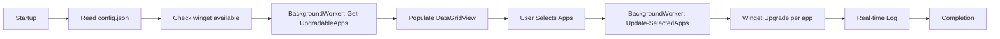

# 🚀 WinUp — Windows App Updater

A modern and intuitive graphical interface for **centralized Windows application update management** via winget.
Browse, select, and update your applications with a single click — no terminal or complex commands needed.

**🆕 Version 2.1.0** — Dark theme, async update engine, config.json support!

[](https://learn.microsoft.com/en-us/powershell/)
[](https://www.microsoft.com/en-us/windows)
[](LICENSE)
[](https://github.com/Fagghino/BOT-AGGIORNA-APP/stargazers)
[](https://github.com/Fagghino/BOT-AGGIORNA-APP/commits/main)

> 🇮🇹 Documentazione italiana disponibile in [`Docs/README.it.md`](Docs/README.it.md)

---

## 🌟 Key Features

### 📊 Modern Tabular Interface
- **Column view:** Name, ID, Current Version, Available Version
- **Auto-sizing columns:** Width automatically optimized to content
- **Multi-selection:** Checkbox for every upgradable application
- **Smart layout:** Resizable panels with interactive splitter

### 🎯 Intelligent Update System
- **Update-first focus:** Shows only upgradable apps at startup
- **Version comparison:** Clear display of installed → available version
- **Optional full view:** Browse all installed apps with one click
- **Selective updates:** Choose exactly which apps to update

### 🎨 Modern Dark Theme UI
- **Dark mode by default:** Easy on the eyes, professional look
- **Segoe UI typography:** Native Windows font throughout
- **Color-coded buttons:** Intuitive visual hierarchy
- **Status bar:** Real-time status feedback at the bottom

### ⚡ Performance & Usability
- **Async loading:** UI stays responsive during data retrieval
- **Async updates:** Winget runs in background — GUI never freezes
- **Quick selection:** "Select All" and "Deselect All" buttons
- **Real-time log:** Monitor update progress live

### 🛡️ Safety & Control
- **No privilege required** for browsing
- **Explicit confirmation:** No update happens without user action
- **Read-only mode:** Full app list view with no accidental changes
- **Native winget integration:** Uses Microsoft's official package manager

---

## ⚙️ How It Works

### 🟢 1. Startup & Loading
When the app opens:
- ✅ Automatically fetches the list of upgradable apps (async)
- ✅ Displays them in a table with clear version info
- ✅ Interface is ready in a few seconds

### 📦 2. Selecting Applications

**Upgradable Apps Mode** *(default)*
- Shows only apps with available updates
- Active checkboxes for selection
- Direct comparison: installed vs. available version
- Quick-select buttons enabled

**All Apps Mode** *(read-only)*
- Shows all winget-installed apps on the system
- No checkboxes (view-only)
- Useful for software inventory
- No accidental modifications possible

### 🔄 3. Update Process
1. **Select** apps by checking their checkboxes
2. **Click** the "Update" button
3. **Monitor** progress in the log area (non-blocking)
4. **Done** when all updates are complete

### 📊 4. Dynamic Interface Layout
```
┌─────────────────────────────────────────────────────────────┐
│  App Name        │ Package ID    │ Installed  │ Available   │
├──────────────────┼───────────────┼────────────┼─────────────┤
│ ☑ Google Chrome  │ Google.Chrome │ 120.0.6099 │ 121.0.6167  │
│ ☐ Firefox        │ Mozilla.Fire. │ 121.0      │ 122.0       │
│ ☑ VS Code        │ Microsoft.Vi. │ 1.85.1     │ 1.86.0      │
└──────────────────┴───────────────┴────────────┴─────────────┘
══════════════════ drag to resize ═══════════════════════════
┌─────────────────────────────────────────────────────────────┐
│ UPDATE LOG                                                  │
│ > Updating Google Chrome...                                 │
│ > Downloading version 121.0.6167...                         │
│ > Installation completed successfully!                      │
└─────────────────────────────────────────────────────────────┘
[Update] [Select All] [Deselect All] [Show All Apps] [Close]
```

---

## 📦 Installation & Usage

### Prerequisites
- Windows 10 (version 1809 or later) or Windows 11
- PowerShell 5.1+ *(included in Windows)*
- Winget *(included by default in Windows 11)*
  - **Windows 10:** Install "App Installer" from the Microsoft Store

### Verify Prerequisites
```powershell
# Check PowerShell version (must be >= 5.1)
$PSVersionTable.PSVersion

# Check winget installation
winget --version
# Expected output: v1.x.xxxxx or higher
```

---

## 🚀 Installation Methods

### **Method 1: Direct Execution** ⚡ *(Recommended)*
Copy and paste into a PowerShell terminal:

```powershell
irm https://raw.githubusercontent.com/Fagghino/BOT-AGGIORNA-APP/main/update.ps1 | iex
```

**Advantages:**
- ✅ No installation needed
- ✅ Always the latest version
- ✅ Single command

### **Method 2: Clone & Run Locally**
```powershell
# Clone the repository
git clone https://github.com/Fagghino/BOT-AGGIORNA-APP.git
cd BOT-AGGIORNA-APP

# Run the script
.\update.ps1
```

**Advantages:**
- ✅ Full customization possible
- ✅ Works offline after first use
- ✅ Complete control over the code

### **Method 3: Direct Download**
1. Download `update.ps1` from the repository
2. Save it to a folder of your choice
3. Run by double-clicking or from PowerShell

---

## 📋 System Requirements

### Operating System
- ✅ Windows 10 (version 1809 or later)
- ✅ Windows 11 (all versions)

### Required Software
- ✅ **PowerShell 5.1+** *(included in Windows)*
- ✅ **Winget** *(included by default in Windows 11)*
  - Windows 10: Install "App Installer" from the Microsoft Store

### Optional Requirements
- 🔓 Administrator privileges: Only needed to update some system-level software
- 🌐 Internet connection: Required to download updates

---

## 🛠️ Technologies & Architecture

### Tech Stack
| Component | Purpose |
|-----------|---------|
| **PowerShell 5.1+** | Main language and runtime |
| **Windows Forms** | Native GUI framework |
| **System.Drawing** | Rendering and graphics library |
| **Winget CLI** | Microsoft's integrated package manager |
| **DataGridView** | Advanced tabular display component |
| **BackgroundWorker** | Async threading for long-running operations |

### Project Structure
```
📁 BOT-AGGIORNA-APP/
├── 📄 update.ps1              # Main script with GUI
│   ├── 🔧 Get-InstalledApps   # Installed apps retrieval
│   ├── 🔧 Get-UpgradableApps  # Upgradable apps filter
│   ├── 🔧 Update-SelectedApps # Update engine (async)
│   └── 🎨 Show-UpdateGUI      # Graphical interface
├── 📄 UpdateAppUtils.psm1     # Utility module (legacy/standalone)
├── 📄 config.json             # Configuration (source, log level)
├── 📁 Docs/
│   ├── 📄 README.it.md        # Italian documentation
│   ├── 📄 CHANGELOG.en.md     # English changelog
│   └── 📄 CHANGELOG.it.md     # Italian changelog
├── 📄 README.md               # This file (English)
├── 📄 LICENSE                 # MIT License
├── 📄 .gitignore              # Git exclusions
└── 📄 .gitattributes          # Git attributes (line endings, linguist)
```

### Architectural Highlights
- 🎯 **Self-contained:** Everything in one file for maximum portability
- 🎯 **Smart parsing:** Automatic handling of multilingual winget output (IT/EN)
- 🎯 **Robust fallbacks:** Automatic recovery from errors via try/catch chains
- 🎯 **Thread-safe UI:** Long operations never block the interface
- 🎯 **config.json aware:** Source and log level loaded from configuration

### Data Flow


---

## 📊 Advanced Features

### 🎯 Intelligent Parsing System
The bot includes an advanced winget output parsing system:
- ✅ Multilingual output support (Italian, English, etc.)
- ✅ Dynamic column-based tabular format parsing
- ✅ Separator and header handling
- ✅ Robust version extraction
- ✅ Fallback for non-standard formats

### ⚡ Asynchronous Architecture
- **Startup BackgroundWorker:** Data loading in background
- **Update BackgroundWorker:** Winget upgrades run without freezing the UI
- **Event-driven UI:** Automatic UI updates via `RunWorkerCompleted`
- **No freezing:** Interface always responsive

### 🛡️ Error Handling
- ✅ Try/Catch on all critical operations
- ✅ Winget availability check at startup
- ✅ User-friendly messages
- ✅ Automatic fallbacks
- ✅ Graceful recovery from invalid states

---

## ⚙️ Configuration

### config.json
The configuration file allows advanced customization:

```json
{
    "wingetSource": "winget",
    "logLevel": "info"
}
```

### Available Parameters
| Parameter | Default | Description |
|-----------|---------|-------------|
| `wingetSource` | `"winget"` | Winget source to use (`"winget"`, `"msstore"`, etc.) |
| `logLevel` | `"info"` | Log detail level (`"debug"`, `"info"`, `"warning"`, `"error"`) |

### UI Customization
Edit `update.ps1` to customize:

```powershell
# Form dimensions
$form.Size = New-Object System.Drawing.Size(900, 700)

# Theme colors (dark mode defaults)
$form.BackColor = [System.Drawing.Color]::FromArgb(30, 30, 46)

# Panel heights
$topPanel.Height = 320
```

---

## 🐛 Troubleshooting

### ❌ Winget not found
```powershell
# Verify winget installation
winget --version
# Expected: v1.x.xxxxx
```
**Solution:**
1. Windows 11: Winget is already installed
2. Windows 10: Install "App Installer" from the Microsoft Store
3. Alternative: Download from [GitHub Winget Releases](https://github.com/microsoft/winget-cli/releases)

### 🔒 Permission errors
```powershell
# Allow PowerShell script execution
Set-ExecutionPolicy -ExecutionPolicy RemoteSigned -Scope CurrentUser

# Or run PowerShell as administrator
# Right-click > "Run as administrator"
```

### 📋 No apps displayed
**Possible causes:**
- Winget not configured correctly
- No apps installed via winget
- No internet connection

**Manual verification:**
```powershell
winget list
winget upgrade
```

### ⚠️ Error during update
**Solutions:**
1. **Run as administrator** for system apps
2. **Close the app** before updating it
3. **Check free disk space**
4. **Review the log** in the bot's message area

### 🔍 Debugging
```powershell
# Enable verbose output
$DebugPreference = "Continue"
.\update.ps1

# Check winget logs
Get-Content "$env:LOCALAPPDATA\Packages\Microsoft.DesktopAppInstaller_*\LocalState\DiagOutputDir\*.log"
```

---

## 📊 Performance

| Metric | Value |
|--------|-------|
| Startup time | ~2–3 seconds |
| Memory usage | ~50–80 MB |
| CPU usage | Minimal (spikes only during updates) |
| Compatibility | Windows 10 (1809+) and Windows 11 |

---

## 🎯 Roadmap

### Planned Features
- **🔍 Search & filters:** Search bar to quickly find apps
- **📊 Statistics:** Dashboard with update info, saved space, etc.
- **🔔 Notifications:** System notifications for available updates
- **⏰ Scheduled updates:** Automatic update scheduler
- **📦 App groups:** Create and manage custom application groups
- **🔐 Exclusion list:** Block updates for specific apps
- **🌐 Multi-source:** Full msstore and custom repository support
- **📁 Export report:** Export app list and update history to CSV/Excel

### Technical Improvements
- **🔄 Auto-refresh:** Automatic detection of new apps/updates
- **📝 Structured logging:** Log rotation and persistence
- **🧪 Unit testing:** Automated test suite
- **🌍 Full i18n:** Complete multilingual support via resource files

---

## 🤝 Contributing & Support

### 🐛 Reporting Bugs
If you find a bug or unexpected behavior:

1. **Check the current version**
   ```powershell
   irm https://raw.githubusercontent.com/Fagghino/BOT-AGGIORNA-APP/main/update.ps1 | iex
   ```

2. **Open a GitHub Issue** with:
   - 📝 Detailed problem description
   - 🔢 Windows and PowerShell version
   - 📸 Screenshots if applicable
   - 📋 Steps to reproduce
   - 📄 Full error messages

3. **Include system info:**
   ```powershell
   $PSVersionTable.PSVersion       # PowerShell version
   winget --version                # Winget version
   [System.Environment]::OSVersion.Version  # Windows version
   ```

### 💡 Feature Requests
1. Check the roadmap first
2. Open an Issue with the `enhancement` label
3. Clearly describe: use case, desired feature, expected benefits

### 🔧 Contributing Code
```bash
# 1. Fork the repository
git clone https://github.com/YOUR-USERNAME/BOT-AGGIORNA-APP.git

# 2. Create a feature branch
git checkout -b feature/feature-name

# 3. Develop and test your changes

# 4. Commit with a descriptive message
git commit -m "feat: add real-time app search"

# 5. Push to your fork
git push origin feature/feature-name

# 6. Open a Pull Request on GitHub
```

**Guidelines:**
- ✅ Commented and readable code
- ✅ Follow existing code style
- ✅ Test on both Windows 10 and 11
- ✅ Update documentation if needed
- ✅ No heavy external dependencies
- ✅ Maintain PowerShell 5.1+ compatibility

### 📞 Support & Community
- 📬 **GitHub Issues**: [Open an issue](https://github.com/Fagghino/BOT-AGGIORNA-APP/issues)
- 💬 **Discussions**: [Community discussions](https://github.com/Fagghino/BOT-AGGIORNA-APP/discussions)
- 📧 **Telegram**: [@MeGustaLaMangusta](https://t.me/MeGustaLaMangusta)
- ⭐ **Star**: If the project is useful to you, leave a star!

---

## 📄 License

This project is released under the **MIT License**.

| You can | Conditions | Limitations |
|---------|-----------|-------------|
| ✅ Use commercially | 📋 Include license copy | ⚠️ No warranty provided |
| ✅ Modify the code | 📋 Credit the original project | ⚠️ No author liability |
| ✅ Distribute copies | | |
| ✅ Private use | | |
| ✅ Integrate in other projects | | |

See the [`LICENSE`](LICENSE) file for the full text.

---

## 🙏 Acknowledgements

### Technologies Used
- **[Microsoft Winget](https://github.com/microsoft/winget-cli)** — Official package manager
- **PowerShell** — Language and runtime
- **Windows Forms** — UI framework
- **.NET Framework** — Base libraries

### Related Projects
- [WingetUI](https://github.com/martinet101/WingetUI) — Alternative GUI for winget
- [Winget-AutoUpdate](https://github.com/Romanitho/Winget-AutoUpdate) — Automatic updates
- [Chocolatey](https://chocolatey.org/) — Alternative package manager

---

## 👨‍💻 Author

**Fagghino**
- 🐙 GitHub: [@Fagghino](https://github.com/Fagghino)
- 📦 Repository: [BOT-AGGIORNA-APP](https://github.com/Fagghino/BOT-AGGIORNA-APP)
- 📫 Issues: [Report a problem](https://github.com/Fagghino/BOT-AGGIORNA-APP/issues)

---

## ⭐ Support the Project

If this project has been useful to you, consider:

- ⭐ **Starring** the repository
- 🐛 **Reporting bugs** to improve quality
- 💡 **Suggesting features** to expand possibilities
- 🔀 **Contributing** with pull requests
- 📢 **Sharing** with other Windows users

Every contribution, big or small, is greatly appreciated! 🙏

---

**Made with ❤️ and PowerShell**

*Simplify your Windows software management, one click at a time.* 🚀
