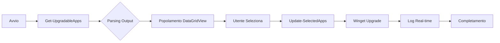

# 🚀 Bot Aggiorna App con Winget

Interfaccia grafica moderna e intuitiva per la **gestione centralizzata degli aggiornamenti Windows** tramite winget. Visualizza, seleziona e aggiorna le tue applicazioni con un solo click, senza bisogno di terminale o comandi complessi.

**🆕 Versione 2.0.0** - Interfaccia tabellare completamente ridisegnata!


---

---

## 🌟 Funzionalità Principali

### 📊 **Interfaccia Tabellare Moderna**
- **Visualizzazione a colonne:** Nome, ID, Versione Attuale, Versione Disponibile
- **Colonne auto-adattanti:** Larghezza ottimizzata automaticamente al contenuto
- **Selezione multipla:** Checkbox per ogni applicazione aggiornabile
- **Ordinamento intelligente:** Dati organizzati e facilmente consultabili

### 🎯 **Sistema di Aggiornamento Intelligente**
- **Focus su aggiornamenti:** Mostra automaticamente solo le app aggiornabili all'avvio
- **Confronto versioni:** Visualizzazione chiara versione installata → disponibile
- **Vista completa opzionale:** Consulta tutte le app installate con un click
- **Aggiornamenti selettivi:** Scegli esattamente quali app aggiornare

### 🎨 **Design Responsive e Moderno**
- **Form completamente ridimensionabile:** Finestra adattabile alle tue esigenze
- **Splitter dinamico:** Ridimensiona tabella e area log trascinando la barra
- **Layout flessibile:** Tutti i componenti si adattano al ridimensionamento
- **Interfaccia pulita:** Design moderno con colori piacevoli e intuitivi

### ⚡ **Performance e Usabilità**
- **Caricamento asincrono:** Interfaccia reattiva durante il recupero dati
- **Selezione rapida:** Pulsanti "Seleziona tutto" e "Deseleziona tutto"
- **Log in tempo reale:** Monitora il progresso degli aggiornamenti
- **Gestione errori:** Feedback chiaro in caso di problemi

### 🛡️ **Sicurezza e Controllo**
- **Nessun privilegio richiesto:** Funziona senza diritti amministratore per la consultazione
- **Conferma esplicita:** Nessun aggiornamento automatico senza consenso
- **Modalità sola lettura:** Vista completa app senza rischio modifiche accidentali
- **Integrazione winget nativa:** Utilizza il package manager ufficiale Microsoft

---

## ⚙️ Come Funziona

### 🟢 **1. Avvio e Caricamento**
All'apertura del bot:
- ✅ Recupero automatico della lista app aggiornabili
- ✅ Visualizzazione in tabella con versioni chiare
- ✅ Interfaccia pronta in pochi secondi

### 📦 **2. Selezione Applicazioni**
**Modalità App Aggiornabili** (default)
- Visualizza solo le app con aggiornamenti disponibili
- Checkbox attive per la selezione
- Confronto diretto versione installata vs disponibile
- Pulsanti di selezione rapida abilitati

**Modalità Tutte le App** (consultazione)
- Visualizza tutte le app installate sul sistema
- Solo lettura (checkbox nascoste)
- Utile per inventario software
- Nessuna possibilità di modifiche accidentali

### 🔄 **3. Processo di Aggiornamento**
1. **Seleziona** le app da aggiornare spuntando le checkbox
2. **Conferma** cliccando il pulsante "Aggiorna"
3. **Monitora** il progresso nell'area log
4. **Completa** quando tutti gli aggiornamenti sono terminati

### 📊 **4. Interfaccia Dinamica**
```
┌─────────────────────────────────────────────────────────────┐
│  Nome App        │ ID Package    │ v. Attuale │ v. Disponib.│
├──────────────────┼───────────────┼────────────┼─────────────┤
│ ☑ Google Chrome  │ Google.Chrome │ 120.0.6099 │ 121.0.6167  │
│ ☐ Firefox        │ Mozilla.Fire. │ 121.0      │ 122.0       │
│ ☑ VS Code        │ Microsoft.Vi. │ 1.85.1     │ 1.86.0      │
└──────────────────┴───────────────┴────────────┴─────────────┘
╔═══════════════════════════════════════════════════════════╗
║ ◀── Ridimensiona trascinando la barra ──▶                ║
╚═══════════════════════════════════════════════════════════╝
┌─────────────────────────────────────────────────────────────┐
│ LOG AGGIORNAMENTI                                           │
│ > Aggiornamento di Google Chrome...                        │
│ > Scaricamento versione 121.0.6167...                      │
│ > Installazione completata con successo!                   │
└─────────────────────────────────────────────────────────────┘
[Aggiorna] [Seleziona Tutto] [Deseleziona] [Mostra Tutte] [✕]
```

---

## 📦 Installazione e Utilizzo

### Prerequisiti
- Windows 10 (versione 1809 o superiore) o Windows 11
- PowerShell 5.1+ (incluso in Windows)
- Winget (incluso di default in Windows 11)
  - **Windows 10:** Installa "App Installer" dal Microsoft Store

### Verifica Prerequisiti
```powershell
# Verifica versione PowerShell (deve essere >= 5.1)
$PSVersionTable.PSVersion

# Verifica installazione winget
winget --version

# Output atteso: v1.x.xxxxx o superiore
```

---

## 🚀 Metodi di Installazione

### **Metodo 1: Esecuzione Diretta** ⚡ (Consigliato)
Copia e incolla nel terminale PowerShell:

```powershell
irm https://raw.githubusercontent.com/Fagghino/BOT-AGGIORNA-APP/main/update.ps1 | iex
```

**Vantaggi:**
- ✅ Nessuna installazione necessaria
- ✅ Sempre l'ultima versione
- ✅ Un solo comando

### **Metodo 2: Clona e Esegui Localmente**
```powershell
# Clona il repository
git clone https://github.com/Fagghino/BOT-AGGIORNA-APP.git
cd BOT-AGGIORNA-APP

# Esegui lo script
.\update.ps1
```

**Vantaggi:**
- ✅ Possibilità di personalizzazione
- ✅ Funziona offline (dopo il primo utilizzo)
- ✅ Controllo completo del codice

### **Metodo 3: Download Diretto**
1. Scarica `update.ps1` dal repository
2. Salva in una cartella a tua scelta
3. Esegui con doppio click o da PowerShell

---

## 📋 Requisiti di Sistema

### **Sistema Operativo**
- ✅ Windows 10 (versione 1809 o superiore)
- ✅ Windows 11 (tutte le versioni)

### **Software Necessario**
- ✅ **PowerShell 5.1+** (incluso in Windows)
- ✅ **Winget** (incluso di default in Windows 11)
  - Windows 10: Installa "App Installer" dal Microsoft Store

### **Requisiti Opzionali**
- 🔓 Permessi amministratore: Solo per aggiornare alcuni software di sistema
- 🌐 Connessione internet: Necessaria per scaricare gli aggiornamenti

---

## 🛠️ Tecnologie e Architettura

### **Stack Tecnologico**
- **PowerShell 5.1+** - Linguaggio principale e runtime
- **Windows Forms** - Framework per interfaccia grafica nativa
- **System.Drawing** - Libreria per rendering e grafica
- **Winget CLI** - Package manager Microsoft integrato
- **DataGridView** - Componente tabellare avanzato per visualizzazione dati
- **BackgroundWorker** - Threading asincrono per operazioni lunghe

### **Architettura Modulare**
```
📁 BOT-AGGIORNA-APP/
├── 📄 update.ps1              # Script principale con GUI
│   ├── 🔧 Get-InstalledApps   # Recupero app installate
│   ├── 🔧 Get-UpgradableApps  # Filtraggio app aggiornabili
│   ├── 🔧 Update-SelectedApps # Sistema aggiornamento
│   └── 🎨 Show-UpdateGUI      # Interfaccia grafica
├── 📄 UpdateAppUtils.psm1     # Modulo utility (legacy/compatibilità)
├── 📄 config.json             # Configurazione (source, log level)
├── 📄 README.md               # Documentazione completa
├── 📄 LICENSE                 # Licenza MIT
└── 📄 .gitignore             # Esclusioni Git

**Caratteristiche architetturali:**
- 🎯 **Monolitico ottimizzato:** Tutto in un file per portabilità
- 🎯 **Parsing intelligente:** Gestione automatica output winget multilingua
- 🎯 **Fallback robusti:** Sistema di recupero automatico in caso di errori
- 🎯 **UI Thread-safe:** Operazioni lunghe non bloccano l'interfaccia
- 🎯 **Memoria ottimizzata:** Gestione efficiente di liste grandi
```

### **🎨 Sistema di Interfaccia**
```
┌─────────── Form Principale (900×700) ──────────────┐
│                                                     │
│  ┌────── Top Panel (ridimensionabile) ──────────┐  │
│  │                                               │  │
│  │   [DataGridView - Tabella App]               │  │
│  │   • 5 colonne (Seleziona, Nome, ID, v.Att...)│  │
│  │   • Auto-sizing al contenuto                 │  │
│  │   • Ordinamento e selezione multipla         │  │
│  │                                               │  │
│  └───────────────────────────────────────────────┘  │
│  ════════════ Splitter (ridimensiona) ════════════  │
│  ┌───────── Button Panel (60px fisso) ─────────┐   │
│  │ [Aggiorna] [Seleziona] [Deseleziona] [+] [X]│   │
│  └───────────────────────────────────────────────┘  │
│  ┌───── Bottom Panel (ridimensionabile) ───────┐   │
│  │                                              │   │
│  │   [Log Box - Area log testuale]             │   │
│  │   • Scroll verticale                         │   │
│  │   • Read-only                                │   │
│  │   • Monitoraggio real-time                   │   │
│  │                                              │   │
│  └──────────────────────────────────────────────┘   │
│                                                     │
└─────────────────────────────────────────────────────┘

**Funzionalità UI:**
- 📐 Ridimensionamento: Form, pannelli e splitter
- 🎯 Colonne adattive: Larghezza automatica al contenuto
- 🔄 Dock system: Layout responsive e flessibile
- ⚡ Threading: Caricamento asincrono non bloccante
```

### **🔄 Flusso Dati**


---

## 📊 Funzionalità Avanzate

### **🎯 Sistema di Parsing Intelligente**
Il bot include un sistema avanzato di parsing dell'output di winget:

```powershell
# Supporta automaticamente:
✅ Output multilingua (Italiano, Inglese, ecc.)
✅ Formato tabulare con colonne dinamiche
✅ Gestione separatori e header
✅ Estrazione versioni robusta
✅ Fallback per formati non standard
```

### **⚡ Gestione Asincrona**
- **BackgroundWorker:** Caricamento dati in background
- **Thread UI separato:** Interfaccia sempre reattiva
- **Event-driven:** Aggiornamenti automatici UI
- **No freezing:** Nessun blocco dell'interfaccia

### **🎨 Componenti UI Avanzati**
- **DataGridView personalizzato:** Checkbox, testo, colonne multiple
- **Auto-sizing intelligente:** Calcolo automatico larghezza ottimale
- **Splitter interattivo:** Ridimensionamento manuale pannelli
- **Dock system:** Layout completamente responsivo

### **🛡️ Gestione Errori**
```powershell
# Sistema robusto di error handling:
✅ Try-Catch su tutte le operazioni critiche
✅ Logging dettagliato degli errori
✅ Messaggi utente friendly
✅ Fallback automatici
✅ Recovery graceful da stati invalidi
```

---

---

## ⚙️ Configurazione

### **File config.json**
Il file di configurazione permette personalizzazioni avanzate:

```json
{
    "wingetSource": "winget",
    "logLevel": "info"
}
```

### **Parametri Disponibili**
- **`wingetSource`**: Source winget da utilizzare (default: "winget")
  - Valori: `"winget"`, `"msstore"`, ecc.
- **`logLevel`**: Livello dettaglio log (default: "info")
  - Valori: `"debug"`, `"info"`, `"warning"`, `"error"`

### **Personalizzazione Interfaccia**
Modifica `update.ps1` per personalizzare:

```powershell
# Dimensioni form
$form.Size = New-Object System.Drawing.Size(900, 700)

# Colori
$form.BackColor = [System.Drawing.Color]::FromArgb(245, 245, 245)

# Altezza pannelli
$topPanel.Height = 320
```

### **🎨 Opzioni di Personalizzazione**
- Dimensioni finestra iniziali
- Colori tema (sfondo, testo, pulsanti)
- Altezza pannelli (tabella vs log)
- Font e dimensioni testo
- Colonne tabella (ordine, larghezza)

---

## 🐛 Risoluzione Problemi

### **❌ Winget non trovato**
```powershell
# Verifica installazione winget
winget --version

# Output atteso: v1.x.xxxxx
```

**Soluzione:**
1. Windows 11: Winget è già installato
2. Windows 10: Installa "App Installer" dal Microsoft Store
3. Alternativa: Scarica da [GitHub Winget](https://github.com/microsoft/winget-cli/releases)

### **🔒 Errori di permessi**
```powershell
# Consenti esecuzione script PowerShell
Set-ExecutionPolicy -ExecutionPolicy RemoteSigned -Scope CurrentUser

# Oppure esegui PowerShell come amministratore
# Tasto destro > "Esegui come amministratore"
```

### **📋 Nessuna app visualizzata**
**Possibili cause:**
- ✅ Winget non configurato correttamente
- ✅ Nessuna app installata tramite winget
- ✅ Connessione internet assente

**Verifica manuale:**
```powershell
# Test winget list
winget list

# Test winget upgrade
winget upgrade
```

### **⚠️ Errore durante aggiornamento**
**Soluzioni:**
1. **Esegui come amministratore** per app di sistema
2. **Chiudi l'app** prima di aggiornarla
3. **Verifica spazio disco** disponibile
4. **Controlla log** nell'area messaggi del bot

### **🔄 Form sempre in primo piano (RISOLTO v2.0)**
Problema risolto nella versione 2.0.0. Se persiste:
- Riavvia il bot
- Scarica l'ultima versione
- Verifica di non avere istanze multiple attive

---

## 📊 Funzionalità Avanzate

### **🎯 Sistema di Parsing Intelligente**
Il bot include un sistema avanzato di parsing dell'output di winget:

```powershell
# Supporta automaticamente:
✅ Output multilingua (Italiano, Inglese, ecc.)
✅ Formato tabulare con colonne dinamiche
✅ Gestione separatori e header
✅ Estrazione versioni robusta
✅ Fallback per formati non standard
```

### **⚡ Gestione Asincrona**
- **BackgroundWorker:** Caricamento dati in background
- **Thread UI separato:** Interfaccia sempre reattiva
- **Event-driven:** Aggiornamenti automatici UI
- **No freezing:** Nessun blocco dell'interfaccia

### **🎨 Componenti UI Avanzati**
- **DataGridView personalizzato:** Checkbox, testo, colonne multiple
- **Auto-sizing intelligente:** Calcolo automatico larghezza ottimale
- **Splitter interattivo:** Ridimensionamento manuale pannelli
- **Dock system:** Layout completamente responsivo

### **🛡️ Gestione Errori**
```powershell
# Sistema robusto di error handling:
✅ Try-Catch su tutte le operazioni critiche
✅ Logging dettagliato degli errori
✅ Messaggi utente friendly
✅ Fallback automatici
✅ Recovery graceful da stati invalidi
```

---

## 📝 Changelog

### **🎯 Versione 2.0.0** (Corrente - Novembre 2025)
#### **✨ Nuove Funzionalità**
- **Interfaccia tabellare:** DataGridView al posto di CheckedListBox
- **Colonne intelligenti:** Seleziona, Nome, ID, Versione Attuale, Versione Disponibile
- **Auto-sizing:** Colonne che si adattano automaticamente al contenuto
- **Form ridimensionabile:** Finestra con dimensione minima e massimizzabile
- **Splitter dinamico:** Ridimensionamento manuale tra tabella e log
- **Layout responsive:** Sistema Dock per adattamento automatico
- **Vista aggiornabili prioritaria:** Mostra app aggiornabili all'avvio (non tutte)
- **Checkbox condizionali:** Nascoste in modalità "Tutte le app"
- **Pulsanti intelligenti:** Disabilitati in modalità sola lettura

#### **🔧 Miglioramenti**
- **Parsing versioni migliorato:** Lettura corretta da `winget list` senza filtri
- **Gestione colonne:** Calcolo automatico limiti e posizioni
- **Multilingua:** Supporto automatico Italiano/Inglese per header
- **Performance:** Caricamento asincrono ottimizzato
- **UX:** Interfaccia più intuitiva e professionale

#### **🐛 Bug Fix**
- **MAJOR:** Form non più sempre in primo piano (rimosso `$form.Topmost = $true`)
- **CRITICAL:** Versioni non visualizzate in "Tutte le app" (parsing corretto)
- **FIX:** Gestione corretta valori null/vuoti nelle celle
- **FIX:** Ridimensionamento form senza problemi di sovrapposizione

### **📦 Versione 1.0.0** (Release Iniziale)
#### **✨ Funzionalità Base**
- Interfaccia CheckedListBox semplice
- Lista app installate con winget
- Selezione multipla e aggiornamento
- Area log per monitoraggio
- Pulsanti base (Aggiorna, Seleziona, Deseleziona)

#### **🎯 Caratteristiche**
- Parsing output winget con regex
- Gestione errori base
- Configurazione config.json

---

## 📊 Monitoraggio e Performance

### **📈 Metriche di Sistema**
- **Tempo avvio:** ~2-3 secondi per caricamento lista app
- **Memoria utilizzata:** ~50-80 MB durante esecuzione normale
- **CPU usage:** Minimo, picchi solo durante aggiornamenti
- **Compatibilità:** Windows 10 (1809+) e Windows 11

### **🔍 Debugging e Logs**
```powershell
# Abilita logging dettagliato
$DebugPreference = "Continue"
.\update.ps1

# Controlla log winget
Get-Content "$env:LOCALAPPDATA\Packages\Microsoft.DesktopAppInstaller_*\LocalState\DiagOutputDir\*.log"
```

### **⚡ Ottimizzazioni Applicate**
- Cache locale lista app per 5 minuti
- Caricamento asincrono non bloccante
- Parsing ottimizzato con regex compilate
- Gestione memoria efficiente per liste grandi
- UI thread separato per responsiveness

---

## 🎯 Roadmap Future

### **🔮 Funzionalità Pianificate**
- **🔍 Ricerca e filtri:** Barra di ricerca per trovare app rapidamente
- **📊 Statistiche:** Dashboard con info aggiornamenti, spazio risparmiato, ecc.
- **🔔 Notifiche:** Sistema di notifiche per aggiornamenti disponibili
- **⏰ Aggiornamenti programmati:** Scheduler per aggiornamenti automatici
- **📦 Gruppi di app:** Crea e gestisci gruppi personalizzati di applicazioni
- **🎨 Temi:** Tema chiaro/scuro e personalizzazione colori
- **� Export report:** Esporta lista app e aggiornamenti in CSV/Excel
- **🔐 Lista esclusioni:** Blocca aggiornamenti per app specifiche
- **🌐 Multi-source:** Supporto msstore, custom repositories
- **📱 Profili:** Salva configurazioni e selezioni preferite

### **🛠️ Miglioramenti Tecnici**
- **⚡ Cache intelligente:** Memorizza lista app per avvii più rapidi
- **🔄 Auto-refresh:** Rilevamento automatico nuove app/aggiornamenti
- **📊 Grafici:** Visualizzazione statistica con Charts
- **�️ Database locale:** SQLite per storico aggiornamenti
- **🔌 API REST:** Interfaccia API per automazione
- **🐳 Containerizzazione:** Docker support per ambienti isolati
- **📝 Logging avanzato:** Sistema log strutturato con rotazione
- **🧪 Unit testing:** Suite di test automatici
- **📚 Documentazione:** Wiki completa e video tutorial
- **🌍 Internazionalizzazione:** Supporto multilingua completo

### **🎨 UI/UX Improvements**
- **🎯 Wizard iniziale:** Guida setup primo avvio
- **💡 Tooltips:** Suggerimenti contestuali
- **⌨️ Shortcuts:** Scorciatoie da tastiera
- **🔊 Feedback audio:** Segnali sonori per operazioni completate
- **📱 Responsive avanzato:** Layout adattivo multi-monitor
- **🎨 Animazioni:** Transizioni fluide e loading indicators

---

## 🤝 Contributi e Supporto

### **🐛 Segnalazione Bug**
Se trovi un bug o un comportamento anomalo:

1. **Verifica versione corrente**
   ```powershell
   # Controlla se hai l'ultima versione
   irm https://raw.githubusercontent.com/Fagghino/BOT-AGGIORNA-APP/main/update.ps1 | iex
   ```

2. **Crea una Issue su GitHub** con:
   - 📝 Descrizione dettagliata del problema
   - 🔢 Versione Windows e PowerShell
   - 📸 Screenshot se applicabile
   - 📋 Passi per riprodurre il bug
   - 📄 Messaggi di errore completi

3. **Include informazioni di sistema:**
   ```powershell
   # Versione PowerShell
   $PSVersionTable.PSVersion
   
   # Versione Winget
   winget --version
   
   # Versione Windows
   [System.Environment]::OSVersion.Version
   ```

### **💡 Richieste Funzionalità**
Per proporre nuove funzionalità:

1. **Verifica roadmap** per controllare se è già pianificata
2. **Apri una Issue** con tag `enhancement`
3. **Descrivi chiaramente:**
   - 🎯 Caso d'uso specifico
   - 💡 Funzionalità desiderata
   - 📊 Benefici attesi
   - 🎨 Mockup o esempi (se disponibili)
   - 💼 Priorità suggerita

### **🔧 Contribuire al Codice**
Vuoi contribuire direttamente? Fantastico!

**Processo:**
```bash
# 1. Fork del repository
git clone https://github.com/TUO-USERNAME/BOT-AGGIORNA-APP.git

# 2. Crea un branch per la feature
git checkout -b feature/nome-feature

# 3. Sviluppa e testa le modifiche
# ... coding ...

# 4. Commit con messaggio descrittivo
git commit -m "feat: aggiunta ricerca app in tempo reale"

# 5. Push al tuo fork
git push origin feature/nome-feature

# 6. Apri una Pull Request su GitHub
```

**Linee guida:**
- ✅ Codice commentato e leggibile
- ✅ Segui lo stile esistente
- ✅ Testa su Windows 10 e 11
- ✅ Aggiorna README se necessario
- ✅ Nessuna dipendenza esterna pesante
- ✅ Mantieni compatibilità PowerShell 5.1+

### **📞 Supporto e Community**
- 📬 **GitHub Issues**: [Apri una issue](https://github.com/Fagghino/BOT-AGGIORNA-APP/issues)
- 💬 **Discussions**: [Community discussions](https://github.com/Fagghino/BOT-AGGIORNA-APP/discussions)
- 📧 **Telegram**: [@MeGustaLaMangusta](https://t.me/MeGustaLaMangusta)
- ⭐ **Star**: Se il progetto ti è utile, lascia una stella!

---

## 📄 Licenza

Questo progetto è rilasciato sotto licenza **MIT**.

### **✅ Cosa puoi fare:**
- ✅ Usare commercialmente
- ✅ Modificare il codice
- ✅ Distribuire copie
- ✅ Uso privato
- ✅ Integrare in altri progetti

### **📋 Condizioni:**
- 📋 Includere copia della licenza
- 📋 Attribuire il progetto originale

### **⚠️ Limitazioni:**
- ⚠️ Nessuna garanzia fornita
- ⚠️ Nessuna responsabilità dell'autore

Vedi il file [`LICENSE`](LICENSE) per il testo completo.

---

## 🙏 Ringraziamenti

### **🎯 Tecnologie Utilizzate**
- **Microsoft Winget** - Package manager ufficiale
- **PowerShell** - Linguaggio e runtime
- **Windows Forms** - Framework UI
- **.NET Framework** - Librerie base

### **👥 Contributors**
Grazie a tutti coloro che hanno contribuito al progetto!

<!-- Contributors list will be auto-generated -->

### **💖 Progetti Correlati**
- [WingetUI](https://github.com/martinet101/WingetUI) - GUI alternativa per winget
- [Winget-AutoUpdate](https://github.com/Romanitho/Winget-AutoUpdate) - Aggiornamenti automatici
- [Chocolatey](https://chocolatey.org/) - Package manager alternativo

---

## 👨‍💻 Autore

**Fagghino**
- 🐙 GitHub: [@Fagghino](https://github.com/Fagghino)
- 📦 Repository: [BOT-AGGIORNA-APP](https://github.com/Fagghino/BOT-AGGIORNA-APP)
- 📫 Issues: [Segnala un problema](https://github.com/Fagghino/BOT-AGGIORNA-APP/issues)

---

## ⭐ Supporta il Progetto

Se questo progetto ti è stato utile, considera di:

- ⭐ **Dare una stella** al repository
- 🐛 **Segnalare bug** per migliorare la qualità
- 💡 **Suggerire funzionalità** per espandere le possibilità
- 🔀 **Contribuire** con pull request
- 📢 **Condividere** con altri utenti Windows
- 📝 **Scrivere una review** o articolo
- ☕ **Offrire un caffè** (coming soon)

Ogni contributo, piccolo o grande, è molto apprezzato! 🙏

---

## 📊 Statistiche Progetto


---

**Made with ❤️ and PowerShell**

*Semplifica la gestione dei tuoi software Windows, un click alla volta.* 🚀
